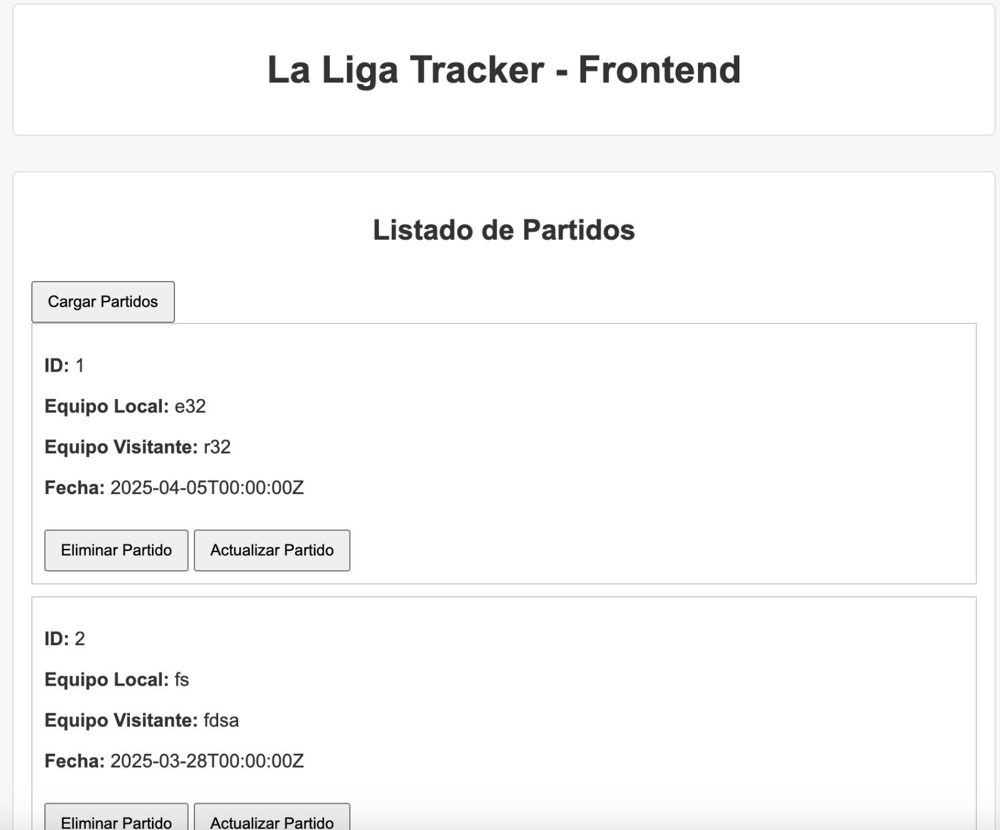

# La Liga Tracker Backend & Frontend

Este proyecto es el backend y frontend de **La Liga Tracker**, una aplicación para gestionar partidos de La Liga. El backend está desarrollado en Go (usando Gin) y se conecta a una base de datos MySQL. El frontend (archivo `LaLigaTracker.html`) se sirve de forma estática desde el mismo backend.

---

## Requisitos

- Docker y Docker Compose
- Go 1.21 (o superior)
- Git

---

## Estructura del Proyecto

lab1and2/
├── Dockerfile
├── docker-compose.yml
├── go.mod
├── go.sum
├── init.sql
├── main.go
└── public/
    └── LaLigaTracker.html
└── imgs/
    └── imgs/e594b348-c193-4b46-b2bb-ac4a58d751a0.jpeg
    
---
- **Dockerfile:** Define el proceso de compilación del backend y la inclusión del frontend.
- **docker-compose.yml:** Orquesta los servicios de MySQL (base de datos) y el backend.
- **init.sql:** Script de inicialización que configura el usuario, plugin de autenticación y crea la tabla `matches`.
- **main.go:** Código del backend (API REST) desarrollado con Gin.
- **public/LaLigaTracker.html:** Archivo estático que representa el frontend de la aplicación.

---



---

## Pasos para Levantar el Proyecto

### 1. Clonar el Repositorio

```bash
git clone https://github.com/AscencioSIUU/laliga-backend.git
cd laliga-backend
```

## configurar las variables del .env

```bash
DB_HOST=localhost
DB_PORT=3306
DB_USER=laliga
DB_PASSWORD=laliga
DB_NAME=laliga
```

## Levantar en docker compose

```bash
docker-compose down -v
docker-compose up --build -d
```
